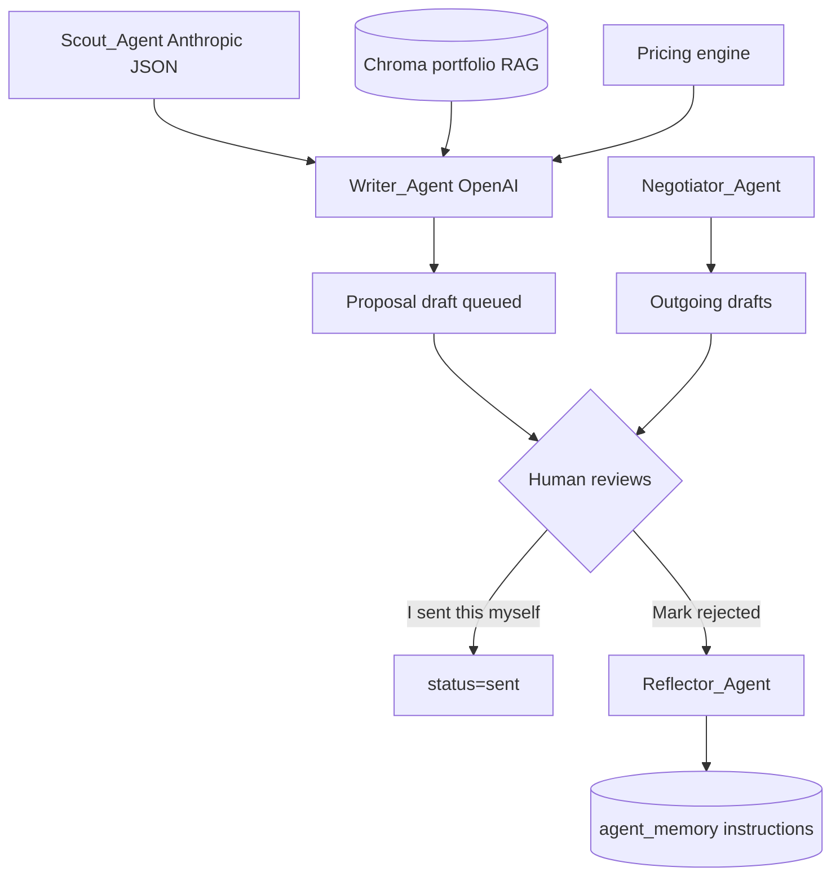
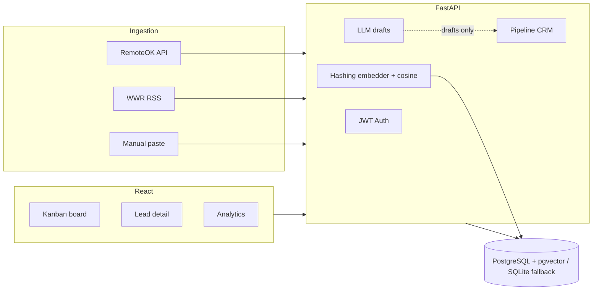

# The Sterling Syndicate

Elite Autonomous Executive Agency (Human-in-the-loop by design)

## Design Philosophy

The Sterling Syndicate is **human-in-the-loop by design**, not by omission. Freelance marketplaces (Upwork, Fiverr, and similar) prohibit bots that scrape gated pages, auto-submit proposals, or interact with clients without a human clicking send. Undisclosed automation is treated as account misrepresentation. This product therefore:

- Never logs into third-party marketplaces or reuses session cookies/OAuth tokens to act as you
- Never sends a proposal, chat reply, or contract message on its own — every outbound artifact is an editable draft labeled `ai_generated`
- Ingests only from sources that allow programmatic access (e.g. RemoteOK API, We Work Remotely RSS) or from text you paste yourself
- Requires an explicit **“I sent this myself”** action after you copy a draft out manually
- **Hard-refuses marketplace login automation** — Playwright stealth helpers exist only for
  allowed / operator-driven sessions and raise on Upwork/Fiverr/etc. hosts; Scout itself
  uses jittered public API/RSS only (no marketplace cookie reuse)

That constraint is what makes the tool usable in the real world.

## Multi-agent architecture (v0.5)



| Agent | Model | Role |
|-------|-------|------|
| Scout | `claude-sonnet-4-20250514` (override via env) | Score/filter jobs — structured JSON, temp 0.1 |
| Writer | `gpt-4o` (override via env) | RAG cover letter — temp 0.6 |
| Negotiator | Anthropic tier-2 JSON | 3 labeled reply drafts |
| Reflector | Anthropic tier-2 JSON | On rejection, append instruction_delta to memory |

Alerts (Telegram/Discord) fire when match ≥ `HIGH_MATCH_THRESHOLD` — notification only.

## Architecture



## Live app (always on — no laptop needed)

Deployed on Render. These URLs stay online 24/7:

- **App:**    https://sterling-web-6u7n.onrender.com  
- **API:**    https://sterling-api-6u7n.onrender.com/docs  
- **Health:** https://sterling-api-6u7n.onrender.com/health  

> On the free tier a service sleeps after ~15 min idle; the next visit wakes it
> and can take 30–60 s. Just refresh once and it loads — nothing needs to run on
> your machine.

## Run locally (optional, for development)

Only needed if you want to develop on your own machine. These `localhost` URLs
work **only while** `start-local.ps1` (or `docker compose up`) is running.

```powershell
cp .env.example .env
# Set JWT_SECRET_KEY (and API keys) at minimum

.\start-local.ps1
```


With Docker:

```bash
cp .env.example .env
docker compose up --build
```

Containers: `sterling-syndicate-db`, `sterling-syndicate-backend`, `sterling-syndicate-frontend` (+ `sterling-syndicate-dind` for sandboxed execution).

## Tech stack

| Layer | Tech |
|-------|------|
| Backend | Python 3.11+, FastAPI, SQLAlchemy, Alembic |
| Database | PostgreSQL 16 + pgvector (or SQLite local fallback if Docker is unavailable) |
| Matching | Deterministic hashing embedder (384-d cosine) — not neural embeddings; swap via `EMBEDDING_MODEL` later |
| LLM | OpenAI / Anthropic APIs (optional; template fallback if unset) |
| Frontend | React, TypeScript, TailwindCSS, Vite, Recharts |
| Auth | HttpOnly cookie JWT + bcrypt + SMTP password reset (token never in JSON body) |
| Infra | Docker Compose |

## Auth & Password Reset

| Endpoint | Schema / Purpose |
|----------|------------------|
| `POST /auth/forgot-password` | `{ "email": "user@example.com" }` → emails `FRONTEND_URL/reset-password?token=…` |
| `POST /auth/reset-password` | `{ "token": "…", "new_password": "…" }` → verifies token, bcrypt-hashes new password |

```
FRONTEND_URL=http://localhost:5173
SMTP_HOST=smtp.gmail.com
SMTP_PORT=587
SMTP_USERNAME=
SMTP_PASSWORD=
SMTP_FROM=
```

If SMTP is empty, the reset link is logged to the API console (local dev). UI routes: `/forgot-password`, `/reset-password`.

## Folder structure

```
The Sterling Syndicate/
├── backend/          # FastAPI app, Alembic, pytest
├── frontend/         # React + Vite UI
├── demo/             # Synthetic sample data (no real clients)
├── docker-compose.yml
├── start-local.ps1
└── .env.example
```

## Enterprise Edge Cases Handled

The Sterling Syndicate hardens failure modes that typically break freelance-automation demos:

### 1. AI-resilient semantic extraction (not CSS scrapers)
Marketplace UIs change constantly; hardcoded Playwright selectors are a liability **and** violate our ToS stance. Instead, already-fetched content (RemoteOK JSON, WWR RSS, manual paste, or user-supplied HTML) is parsed by **structured LLM JSON** for title / description / budget / category, with a deterministic heuristic fallback. No marketplace login automation. Stealth browser helpers hard-refuse Upwork/Fiverr hosts.

### 2. Prompt-injection guardrails (Aegis-style with OutputSanitizer)
Untrusted job posts and client messages pass through `prompt_guard` **before** Writer / Negotiator. Patterns such as “ignore previous instructions”, system-role hijacks, and jailbreak markers are neutralized; remaining text is wrapped in `<<<UNTRUSTED_*>>>` envelopes so models treat it as data, not commands. `OutputSanitizer` strips those meta-tags from API responses before the CRM UI ever sees them.

### 3. Semantic AST chunking for RAG
GitHub ingest no longer dumps whole repos into Chroma. `ast_chunking` extracts Python functions/classes/docstrings (stdlib `ast`), JS/TS symbols via lightweight patterns, and markdown sections — while **excluding** lockfiles, `node_modules`, build artifacts, and config boilerplate. That keeps retrieval focused and avoids context overflow.

### 4. Idempotent SHA-256 task queue
Every lead gets `content_hash = SHA-256(user_id|source|url_or_normalized_text)`. A unique DB index on `(user_id, content_hash)` plus an in-process (optional Redis) lock drops duplicate cron/UI ingest before a second agent run can spend tokens. Concurrent Scout + manual paste of the same job cannot double-bill the LLM.

### 5. Financial Profit Guard & Payment Kill-Switch
When a deal is won or a client claims payment, the contract enters `pending_payment_verification` with `is_payment_verified = false` — freezing Writer, Negotiator, and deliverable updates (HTTP **423 Locked**) until you click **Confirm Payment Received** in the CRM. After verification, `ProfitGuard` hard-caps elite-model spend at **exactly 10%** of `agreed_price`; at the ceiling, generation force-stops and the lead enters `paused_for_budget_extension` for human authorization.

## Security checklist

- [x] Secrets from environment only (`.env` gitignored)
- [x] `./data/`, `*.db`, `*.sqlite3`, and `chroma_db/` gitignored — no local DB leaks
- [x] Pydantic validation on free-text inputs
- [x] Passwords bcrypt-hashed, never logged
- [x] Rate limits on ingest + LLM endpoints
- [x] CORS allowlist (no `*` in config)
- [x] AI artifacts labeled `ai_generated` in DB + UI
- [x] OutputSanitizer strips `<<<UNTRUSTED_*>>>` / system tags from API responses
- [x] Fernet field-level encryption at rest for sensitive client data (`FIELD_ENCRYPTION_KEY`)
- [x] Global rate limiting (120/min, process-local — use `UVICORN_WORKERS=1` or Redis at scale)
- [x] CSRF header required for cookie-authenticated mutating requests
- [x] `TRUST_PROXY` gate on X-Forwarded-For (spoof-safe when false)
- [x] Strict Security Headers (HSTS, X-Content-Type-Options, X-Frame-Options; CSP on static/nginx)
- [x] Global Error Masking (500s never leak stack traces)
- [x] `pip-audit` (backend) and `npm audit` (frontend) wired into CI
- [x] Optional `SIGNUP_INVITE_CODE` to lock open registration

## Data retention

Store only pipeline-needed fields. Delete a lead (and cascades) when a client asks for erasure. Sensitive free-text such as the client display name is encrypted at rest with Fernet when `FIELD_ENCRYPTION_KEY` is set (via the `EncryptedStr` column type; generate a key with `python -c "from cryptography.fernet import Fernet; print(Fernet.generate_key().decode())"`). Existing plaintext rows keep working — decryption passes them through — so the key can be enabled at any time. Do not commit real client data — use `demo/` synthetics for screenshots. Local SQLite / Chroma under `./data/` stay gitignored.

## License

MIT — portfolio / hiring use welcome.
